# Documentation for Project 7 - DevOps Tooling Solution
- Step 1 -- Setup Servers on AWS 
  
   - `sudo apt-get update && sudo apt-get upgrade` 

   -  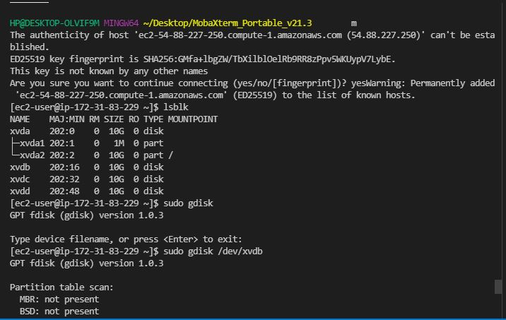
  
### Create volumes, mount volumes, partion volumes

    ```
    sudo gdisk /dev/xvdf
    sudo yum install lvm2
    sudo lvmdiskscan
    sudo pvcreate /dev/xvdb1
    sudo pvcreate /dev/xvdc1
    sudo pvcreate /dev/xvdb1
    sudo vgcreate webdata-vg /dev/xvdh1 /dev/xvdg1 /dev/xvdf1
    sudo lvcreate -n lv-logs -L 9G nfs-vg
    sudo lvcreate -n lv-apps -L 8G nfs-vg
    sudo lvcreate -n lv-opt  -L 9G nfs-vg
    sudo vgdisplay -v #view complete setup - VG, PV, and LV
    sudo lsblk 
    sudo mkfs -t xfs /dev/nfs-vg/apps-lv
    sudo mkfs -t xfs /dev/nfs-vg/logs-lv
    sudo mkfs -t xfs /dev/nfs-vg/opt-lv
    ```
### Mounting Directories 
    ```
    sudo mount /dev/nfs-vg/lv-logs /mnt/logs
    sudo mount /dev/nfs-vg/lv-apps /mnt/apps
    sudo mount /dev/nfs-vg/lv-opt /mnt/opt
    sudo nano /etc/fstab 
    ```
### Installing NFS Server 

    ```
    sudo yum -y update
    sudo yum install nfs-utils -y
    sudo systemctl start nfs-server.service
    sudo systemctl enable nfs-server.service
    sudo systemctl status nfs-server.service
    ```

  - 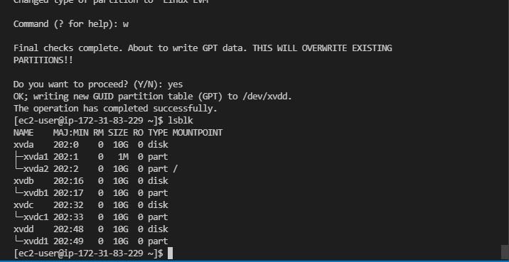
  - 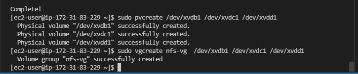
  - 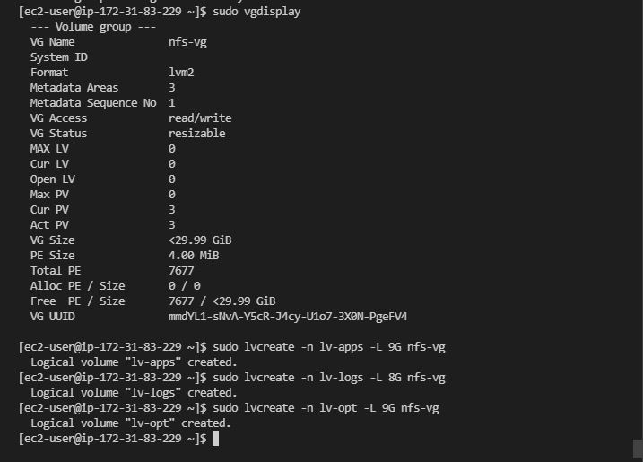
  - 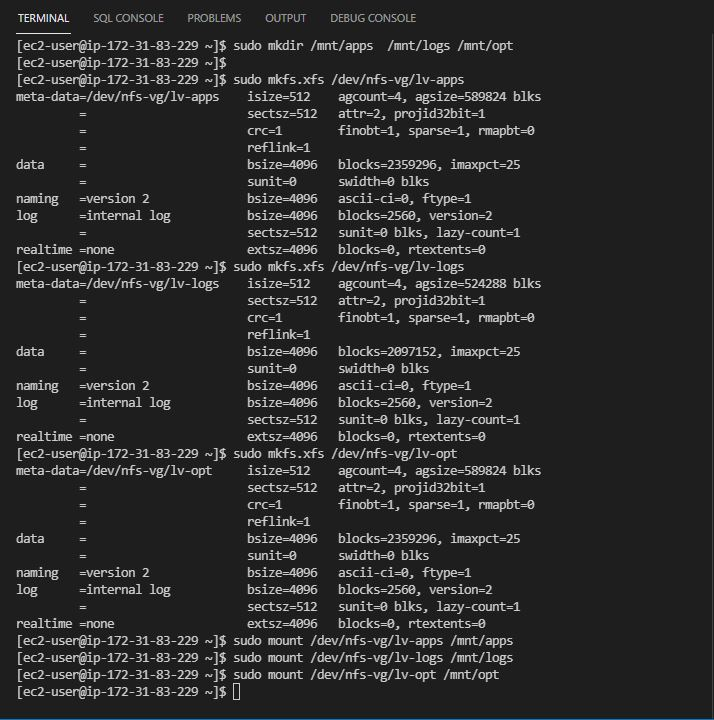
  - 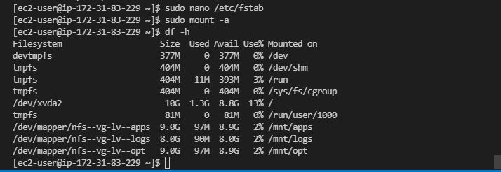
  - 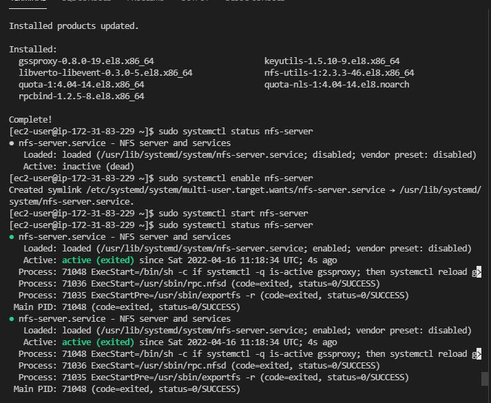

### Create and connect to Database Server
     ```
	sudo mysql
	CREATE DATABASE wordpress;
	CREATE USER `myuser`@`<Web-Server-Private-IP-Address>` IDENTIFIED BY 'mypass';
	GRANT ALL ON wordpress.* TO 'myuser'@'<Web-Server-Private-IP-Address>';
	FLUSH PRIVILEGES;
	SHOW DATABASES;
	exit
	```

  - 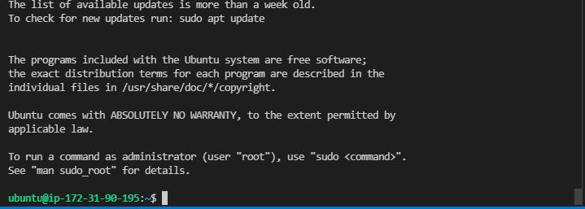
  - 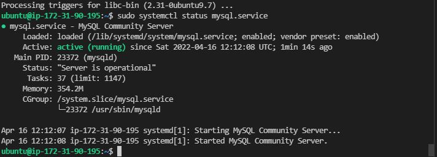
  - 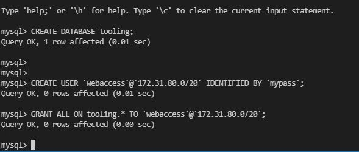
  

### Create, connect and configure WebServers 
    `sudo nano shell.sh && sudo chmod +x shell.sh`
    ```
    ### Webserver Configuration scripts PBL Project 7
    #!/bin/bash
    sudo yum install nfs-utils nfs4-acl-tools -y 
    sudo mkdir  /var/www
    sudo mount -t nfs -o rw,nosuid 172.31.83.229:/mnt/apps /var/www
    sudo echo "172.31.83.229:/mnt/apps /var/www xfs defaults 0 0" >> /etc/fstab
    sudo yum install httpd -y
    sudo dnf install https://dl.fedoraproject.org/pub/epel/epel-release-latest-8.noarch.rpm -y
    sudo dnf install dnf-utils http://rpms.remirepo.net/enterprise/remi-release-8.rpm -y
    sudo dnf module reset php -y

    sudo dnf module enable php:remi-7.4 -y

    sudo dnf install php php-opcache php-gd php-curl php-mysqlnd -y 
    sudo systemctl start php-fpm
    sudo systemctl enable php-fpm
    setsebool -P httpd_execmem 1
    ```
    `sudo su  && ./shell.sh`

   - 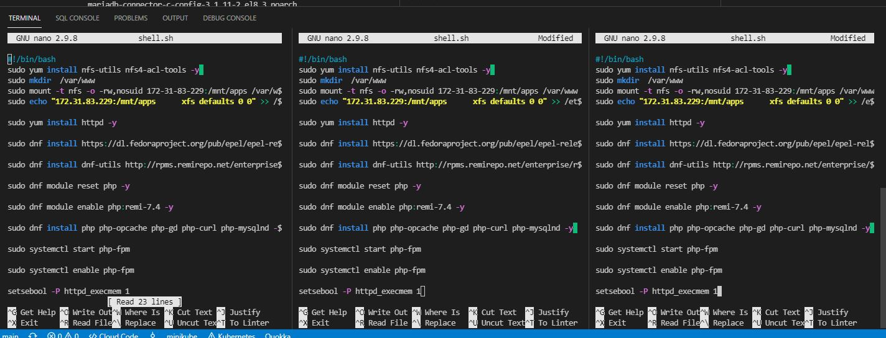
   - 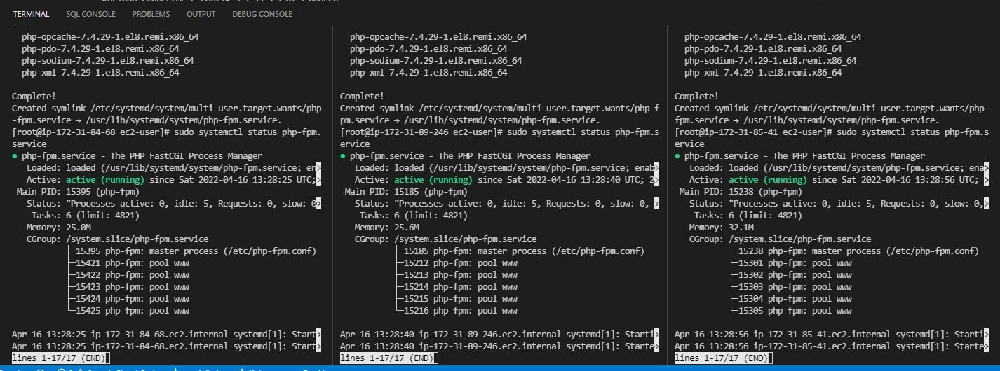
   - 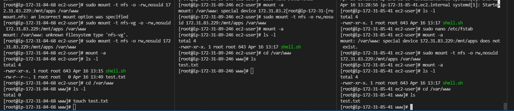
 
### Connect to Mysql Server from WebServer
	```
	sudo yum install mysql
	sudo mysql -u admin -p -h <DB-Server-Private-IP-address>
	```
   - 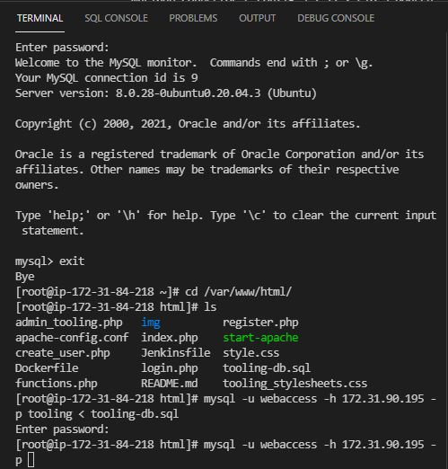
   - 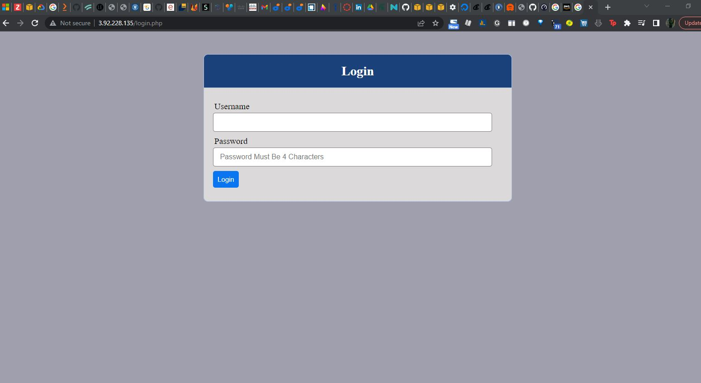

### Connecting to the Webclient 
   - 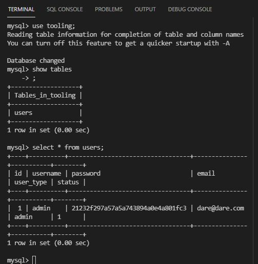
   - 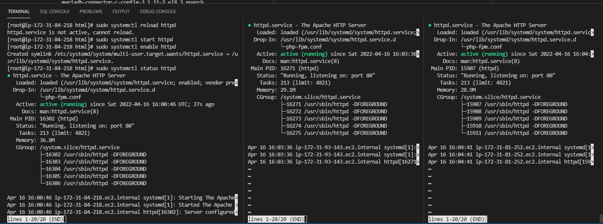
   - 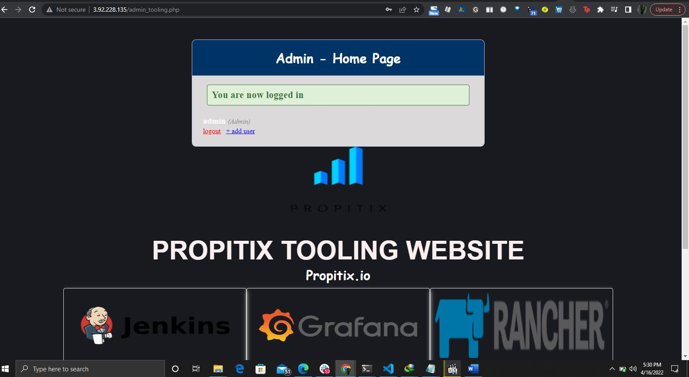